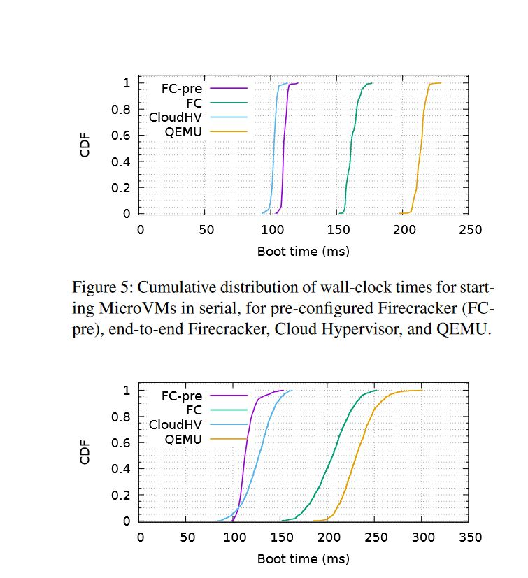
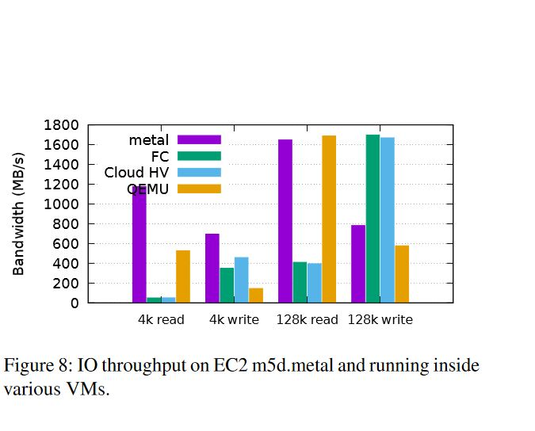

# :notebook: Summary

### :nerd_face: What is Firecracker? 
AWS lambda provides clients to run code based on incoming requests or events. This provides customers with scalability without having to manage or provision servers. Due to the economies of scale, it is important for multinency to be supported. Multitenancy is the provisioning and sharing of workloads across servers, in this case lambda functions. This provides a distinct economic advantage through greater utilization of hardware resources. However, this creates some distinct challenges such as ensuring isolation between workloads and clients as well as quick startup time in response to quick changes in traffic demands.

Firecracker was introduced to specifically address these challenges. Firecracker is an open source virtual machine monitor that is specialized for server less workloads. Implemented with a minimal feature set, Firecracker only contains 50k lines of Rust which is 96% fewer than QEMU. Device drivers such as GPU, USB, displays and speakers could be removed as they are not required in the context of server less computing provided by lambda.


### :mag_right: Why does Firecracker exists? 

The diagram below describes the previous architecture that supported AWS lambda. Understanding the limitations and tradeoffs in this design will help provide a good inclination as to why Firecracker was deemed necessary and ultimately developed.


**Linux containers** provided isolation between multiple functions.  
**Virtual machines** provided isolation between multiple clients.

This system provided **benefits** of:
* **Isolation**: These two mechanisms provided multiple functions to be able to be run on the same hardware while being protected from privilege escalation and information disclosure.
* **Overhead and density** Multiple functions could be deployed on the same resources. However, density can be limited as the resources associated with each client is already being consumed before any workloads have been deployed and can perform any useful work.
* Defense in depth as workloads from different clients are separated in both virtual machines as well as containers.

**Trade offs** of this system included: 
* **Soft allocation** is where hardware resources is not over committed and each function only consumes the resources it needs and not it is entitled to. Difficulty in provisioning sufficient resources for each virtual machine to support the multiple functions as well as ensuring sufficient management and efficient utilization of resources across different virtual machines. This design could lead to waste if the demand for the workloads for a client does not meet the amount of resources that have been provisioned. This makes ensuring density in the system a challenge. 
* **Compatibility** involves supporting unmodified code (in this case Linux libraries). Containers rely on a single operating system creating a tradeoff between security and code compatibility. Containers can improve security by limiting syscalls at the risk of breaking code that requires those syscalls.
* **Fast Switching** VM startup time range in the region of seconds. This is particularly impactful in lambda as deployments of functions are small and thus relative overhead is much larger. Booting smaller lightweight kernels are not a option in this scenario due to the requirement compatibility aforementioned
* **Performance** of workloads must be consistent. Although, containers provide isolation through namespaces, they must still share the same resources. Access to these resources will have are limited using the Linux functionality cgroups if there is contention for resources between separate containers.
* Hypervisors and VMM must communicate with the underlying kernel and thus adding a significant amount to the TCB. 

### :goal_net: Firecracker's goals.

Firecracker was developed to target these challenges while attempting to satisfy properties of Isolation, Overhead and density, Performance, Compatability, Fast Switching and lastly Soft Allocation.

# :bow_and_arrow: Target Domain

### :money_with_wings: Where is it valuable?

To understand why Firecracker is valuable, we first need to understand the **needs of Lambda and what services it is attempting to provide**. AWS Lambda scales applications in response to incoming events. Processes trigger workloads individually and needs to support request scaling from a few per day to thousands per second. [[2]](#References) Lambda also promises code to not require infrastructure in order to be managed and will scale up and down automatically.

Therefore it is important that Firecracker has a low boot latency to ensure startup time is not exposed to its customers. One of the factors that impacts boot time are probing for device drivers. Therefore, kernel features and modules that are not necessary for a typical server less and container workloads can be excluded from the kernel configuration. Removing unnecessary emulated drivers ensures faster boot up time as well as decreasing the lines of code of Firecracker. This decreases the size of the trusted code base thus increasing confidence of the system security.

One firecracker process runs per MicroVM. This achieves a few of the goals required of the system. Single process VMs provide a simple model for security isolation. Overhead and density as well as soft allocation is ensured. This may seem a bit counter intuitive at first. Starting process in a virtualized environment has inherent overhead in memory usage related to booting the dedicated kernel. However, due to the minimal guest kernel configuration supported, the relative overhead in this system is low. Therefore, by having a single process per VM, Firecracker VMs can be pre configured to consume only the amount of memory and CPU resources required of that process, ensuring that resources are not over committed. 

### :no_good: Where is it not a good fit?

Firecracker is more suited to be integrated with applications that has an event driven API. Long running an memory intensive workloads, would not be able to benefit greatly from Firecracker main selling point of being able to scale up and down.

# :gear: What are the "modules" of the system?

Firecracker contains many small modules written in Rust which provide a role in isolation and ochestration between separate VMs. A single micro **Virtual Machine Manager process** exposes an API endpoint to the host once started. The endpoint can be used to configure the microVM resources,- such as CPU, memory, netorking - system metrics and booting and starting the VM.

### The VMM is exposed through a RESTful API
Firecracker is regulated via VmmAction's which provide an entry points into VMM logic. Some VmmActions include FlushMetrics, Pause, Resume,StartMicroVm ect.
The API exposes different values of request that can be defined from a json request body. 
````
let json = r#"{
                "action_type": "FlushMetrics"
            }"#; 
An example of a JSON request body to flush system metrics.
````
JSONs are parsed and the request is made. The following provides an example of sending a request to init a VM 
````
parsedRequest::new_sync(VmmAction::StartMicroVm);

Example of sending a request to init a VM.
````

Requests can also come in over HTTP, which are parsed for the matching action request below
```rust
/*
 * Ryan: Creates a wrapper around the incoming HTTP Request
 * Append the minimum request to the handler's
 * pending_request queue
 */
self.pending_request = Some(Request {
    request_line: RequestLine::try_from(line)
        .map_err(ConnectionError::ParseError)?,
    headers: Headers::default(),
    body: None,
});
self.state = ConnectionState::WaitingForHeaders;
Ok(true)
```
* [Source](https://github.com/firecracker-microvm/firecracker/blob/main/src/micro_http/src/connection.rs#L161-L196)

`self.pending_request` is a queue of incoming requests over this HTTP connection

These requests are popped off of the HTTP connection's queue and onto the Client's below

```rust
/*
 * Ryan: the above are all error cases, the loop below is the intended behavior
 *   removes the request from the connection (allowing it to listen for more requests), and place it 
 *   in the client struct's request queue to be dealt with later
 */
Ok(()) => {
    while let Some(request) = self.connection.pop_parsed_request() {
        // Add all valid requests to `parsed_requests`.
        parsed_requests.push(request);
    }
}
```
* [Source](https://github.com/firecracker-microvm/firecracker/blob/main/src/micro_http/src/server.rs#L97-L150)

#### The VMM:

* The VMM is responsible for handling pre-boot and runtime requests from the firecracker VMM, as well as setting the boot configuration and setting up the VM for boot.

* Pre-boot event handler
```rust
pub fn handle_preboot_request(&mut self, request: VmmAction) -> ActionResult {
        use self::VmmAction::*;

        match request {
            // Supported operations allowed pre-boot.
            ConfigureBootSource(config) => self.set_boot_source(config),
            ConfigureLogger(logger_cfg) => {
                vmm_config::logger::init_logger(logger_cfg, &self.instance_info)
                    .map(|()| VmmData::Empty)
                    .map_err(VmmActionError::Logger)
            }
            ConfigureMetrics(metrics_cfg) => vmm_config::metrics::init_metrics(metrics_cfg)
                .map(|()| VmmData::Empty)
                .map_err(VmmActionError::Metrics),
            GetBalloonConfig => self.balloon_config(),
            GetVmConfiguration => Ok(VmmData::MachineConfiguration(
                self.vm_resources.vm_config().clone(),
            )),
            InsertBlockDevice(config) => self.insert_block_device(config),
            InsertNetworkDevice(config) => self.insert_net_device(config),
            LoadSnapshot(config) => self.load_snapshot(&config),
            SetBalloonDevice(config) => self.set_balloon_device(config),
            SetVsockDevice(config) => self.set_vsock_device(config),
            SetVmConfiguration(config) => self.set_vm_config(config),
            SetMmdsConfiguration(config) => self.set_mmds_config(config),
            StartMicroVm => self.start_microvm(),
```
[Source](https://github.com/firecracker-microvm/firecracker/blob/main/src/vmm/src/rpc_interface.rs#L279-L318)

#### Building and Booting the microVM

* The following code sets the config info for the microVM

```rust
pub fn build_microvm_for_boot(
    vm_resources: &super::resources::VmResources, // VmResources (IMPORTANT) struct for this VM
    event_manager: &mut EventManager, 
    seccomp_filter: BpfProgramRef,
) -> std::result::Result<Arc<Mutex<Vmm>>, StartMicrovmError> {
    use self::StartMicrovmError::*;
    let boot_config = vm_resources.boot_source().ok_or(MissingKernelConfig)?;
    
    //continued below
```
* [Source](https://github.com/firecracker-microvm/firecracker/blob/main/src/vmm/src/builder.rs#L286-L292)

* Why is the VmResources struct important? Well,

```rust
pub struct VmResources {
    /// The vCpu and memory configuration for this microVM.
    vm_config: VmConfig,
    /// The boot configuration for this microVM.
    boot_config: Option<BootConfig>,  // IMPORTANT!!!
    /// The block devices.
    pub block: BlockBuilder,
    /// The vsock device.
    pub vsock: VsockBuilder,
    /// The balloon device.
    pub balloon: BalloonBuilder,
    /// The network devices builder.
    pub net_builder: NetBuilder,
    /// The configuration for `MmdsNetworkStack`.
    pub mmds_config: Option<MmdsConfig>,
    /// Whether or not to load boot timer device.
    pub boot_timer: bool,
}
```
* [Source](https://github.com/firecracker-microvm/firecracker/blob/main/src/vmm/src/resources.rs#L78-L96)

* The `VmResources.boot_config` member is returned from the vm_resouces.boot_source() if it exists, this is what allows for the pre-configuration that makes firecracker so fast!
    - Note: the call to `ok_or()` on the object returned by `boot_source()` will throw an error if there is no boot configuration.

[The request](https://github.com/firecracker-microvm/firecracker/blob/dc893ea25fbe730420003bc4d82b4dc2fc7ce296/src/api_server/src/parsed_request.rs#L36) is then [matched](https://github.com/firecracker-microvm/firecracker/blob/dc893ea25fbe730420003bc4d82b4dc2fc7ce296/src/api_server/src/parsed_request.rs#L58) for the corresponding action/method to be run and system metrics are updated.   


### Jailer:
The jailer process is responsible for starting a new Firecracker process. The jailer initializes system resources that require higher priviledges and executes into the Firecracker binary which spawns a new Firecracker process which runs in the microVM as an unpriviledged process.

The jailer creates a wrapper around Firecracker which creates another layer of security and isolation.

Once the jailer is invoked, a new Environment is created based on the parsed arguments. See the code [here](https://github.com/firecracker-microvm/firecracker/blob/master/src/jailer/src/main.rs#L367-L377).

```rust
pub struct Env {
    id: String,
    chroot_dir: PathBuf,
    exec_file_path: PathBuf,
    uid: u32,
    gid: u32,
    netns: Option<String>,
    daemonize: bool,
    start_time_us: u64,
    start_time_cpu_us: u64,
    extra_args: Vec<String>,
    cgroups: Vec<Cgroup>,
}
```

Running an Env joins the specified network (if applicable), initializes the cgroups, and sets up the folder hierarchy and permissions. The chroot contains the Firecracker binary (which spawns the Firecracker process), cgroup control files, and any resources the microVM requires. 

Once everything is initialized, the Env [executes the specified exec_file](https://github.com/firecracker-microvm/firecracker/blob/main/src/jailer/src/env.rs#L450-L462) passed into the jailer which will create a new Firecracker process. 


### Rate limiter: 
Allows users to control through Firecracker's RESTful API how network and storage resources are shared, even across thousands of microVMs.

The rate limiter uses a [token system](https://github.com/firecracker-microvm/firecracker/blob/dc893ea25fbe730420003bc4d82b4dc2fc7ce296/src/rate_limiter/src/lib.rs#L240) to limit the number of operations per second as well as bandwidth. Each typer of token has a coresponding bucket with a budget that it has been allocated. If any of the buckets run out of budget, the limiter will enter a blocked state. At this point a timer will then notify the user to retry sending the data. 


## Module Interaction

### VMM and Client
* The VMM and Client communicate through the RESTful API detailed above (TODO: add link)

### VMM and KVM
* The KVM is loaded into firecracker as a crate (read: library) and is set up as part of the [create_vmm_and_vcpus()](https://github.com/firecracker-microvm/firecracker/blob/main/src/vmm/src/builder.rs#L206) function.

```rust

pub(crate) fn setup_kvm_vm(
    guest_memory: &GuestMemoryMmap,
    track_dirty_pages: bool,
) -> std::result::Result<Vm, StartMicrovmError> {
    use self::StartMicrovmError::Internal;
    let kvm = KvmContext::new()
        .map_err(Error::KvmContext)
        .map_err(Internal)?;
    let mut vm = Vm::new(kvm.fd()).map_err(Error::Vm).map_err(Internal)?;
    vm.memory_init(&guest_memory, kvm.max_memslots(), track_dirty_pages)
        .map_err(Error::Vm)
        .map_err(Internal)?;
    Ok(vm)
}
```

* This function calls the constructor for a `KvmContext` object. 
    - This constructor instatiates a KVM object (which just holds some configuration/capability information of the KVM) and then checks a set of capabilities based on the architecture.
```rust
  // A list of KVM capabilities we want to check.
        #[cfg(target_arch = "x86_64")]
        let capabilities = vec![
            Irqchip,
            Ioeventfd,
            Irqfd,
            UserMemory,
            SetTssAddr,
            Pit2,
            PitState2,
            AdjustClock,
            Debugregs,
            MpState,
            VcpuEvents,
            Xcrs,
            Xsave,
            ExtCpuid,
        ];

        #[cfg(target_arch = "aarch64")]
        let capabilities = vec![
            Irqchip, Ioeventfd, Irqfd, UserMemory, ArmPsci02, DeviceCtrl, MpState, OneReg,
        ];
```

* [Source](https://github.com/firecracker-microvm/firecracker/blob/main/src/vmm/src/vstate/system.rs#L60-L82)

### VMM and Host Kernel
* The VMM makes calls to the host kernel to assist in loading the VM kernel image and the initial set up of guest memory.
    - As part of the function [build_microvm_for_boot](https://github.com/firecracker-microvm/firecracker/blob/main/src/vmm/src/builder.rs#L286) the VMM calls `load_kernel()`, passing in the boot configuration and guest memory mapping as arguments.

```rust
fn load_kernel(
    boot_config: &BootConfig,
    guest_memory: &GuestMemoryMmap,
) -> std::result::Result<GuestAddress, StartMicrovmError> {
    let mut kernel_file = boot_config
        .kernel_file
        .try_clone()
        .map_err(|e| StartMicrovmError::Internal(Error::KernelFile(e)))?;

    let entry_addr =
        kernel::loader::load_kernel(guest_memory, &mut kernel_file, arch::get_kernel_start())
            .map_err(StartMicrovmError::KernelLoader)?;

    Ok(entry_addr)
}
```

* the `kernel::loader::load_kernel()` function is a host function that loads the elf headers and entries and does the initial mapping of the kernel image to the guest memory.
- See the function [here](https://github.com/firecracker-microvm/firecracker/blob/main/src/kernel/src/loader/mod.rs#L79-L151)

* [Source](https://github.com/firecracker-microvm/firecracker/blob/main/src/vmm/src/builder.rs#L468-L482)
### System metrics: 
The system store two types of metrics. Shared stored metrics are metrics that do not require a counter such as [performance metrics for VM boot time](https://github.com/firecracker-microvm/firecracker/blob/dc893ea25fbe730420003bc4d82b4dc2fc7ce296/src/logger/src/metrics.rs#L542). Shared incremental metrics are metrics that do require a counter such as the number of [API request that trigger specific actions](https://github.com/firecracker-microvm/firecracker/blob/dc893ea25fbe730420003bc4d82b4dc2fc7ce296/src/logger/src/metrics.rs#L300) and the number of [failed requests](https://github.com/firecracker-microvm/firecracker/blob/dc893ea25fbe730420003bc4d82b4dc2fc7ce296/src/api_server/src/request/actions.rs#L32).

# How components communicate.

### Event Manager:

The event manager provides an abstraction through event manager interface to provide communication between the different modules in the system support virtualized IO. Epoll monitors multiple file descriptors to see if I/O is possible on any of them. [[3]](#References)

The epoll_wait system call returns file descriptors that are ready for IO. This is then stored inside a buffer. A hashmap contains the list of 'subscribers' that are the processes listening to the file descriptor for IO to be performed.  


```rust
pub struct EventManager {
    epoll: Epoll,
    subscribers: HashMap<RawFd, Arc<Mutex<dyn Subscriber>>>,
    ready_events: Vec<EpollEvent>,
}
```

# Where are the isolation boundaries present?
 


Firecracker introduces multiple layers of isolation into the system. Each Firecracker process is isolated from the other microVMs by the jailer barrier (darker red). This barrier isolates the different microVMs from each other. Furthermore, there is another virtualization barrier (lighter red) which further isolates the customer from the rest of the microVM.

For more information on these isolation boundaries, see the image under "Firecracker Security."

# Core abstractions of Firecracker

Because the serverless model provides many challenges when it comes to workload and customer isolation, Firecracker completely replaced QEMU and implemented a custom VMM, device model, and API for managing and configuring multiple microVMs. 

The custom built API abstraction allows the ability to pre-configure microVMs which is a major component that allows Firecracker's extremely fast boot times.

The jailer provides an abstraction for spawning new Firecracker process (or spawning new microVMs). The jailer is also used as a protection barrier between the different VMs.


# Firecracker Security


### Security Principles
**Defense in Depth:** Firecracker has strong VM isolation and containment by having several nested layers of depth, each with different levels of trust and access. Further, Firecracker also contains different barriers that enforce different aspects of security. These layers and barriers combine to give Firecracker strong defense in depth.

**Minimal Trusted Computing Base (TCB):** Firecracker's codebase is ~50k LoC which is 96% less than QEMU. Furthermore, their minimalist design removes all unecessary resources from the system which makes the Firecracker TCB small.

**Separation of Privelege:** A new firecracker VM is booted up to service each request. These VMs run at a lower privilege level than the EventManager or VMM and only communicate with the VMM through a predefined set of requests.

### CIA
**Confidentiality:** Requests are kept confidential to the VM they run in, which is created and destroyed when the request enters and exits the system. Since one firecracker process runs per MicroVM, we have a pretty clear case for isolation.  

**Integrity:** Once booted, a firecracker VM is even more strictly limited with how it can interact with the VMM.
```rust
// Operations not allowed post-boot.
ConfigureBootSource(_)
| ConfigureLogger(_)
| ConfigureMetrics(_)
| InsertBlockDevice(_)
| InsertNetworkDevice(_)
| LoadSnapshot(_)
| SetBalloonDevice(_)
| SetVsockDevice(_)
| SetMmdsConfiguration(_)
| SetVmConfiguration(_)
| StartMicroVm => Err(VmmActionError::OperationNotSupportedPostBoot),
```
Firecracker limits the kernel's that can be used to boot a firecracker VM to well known operating systems (i.e. Linux), creating more barriers between a malicious user and the VMM.

**Accessibility:** Since the VMs are not persistent, the only way to cause a denial of service would be to prevent the system from creating new VMs, which would be a lot harder than just sending requests to the same persistent server. By having a single process per VM, Firecracker VMs can be pre configured to consume only the amount of memory and CPU resources required of that process, which prevents a single firecracker VM from using up all of the resources available.

### Reference Monitor

The jailer checks whether the microVM has access to certain resources (which provides complete mediation) and validates all paths and the VMs `id` when starting a new microVM. The Event Manager is responsible for validating the notifications and executing the events that occur in the system.

The jailer executes at a higher level of privilege which prevents attacks that will allow a user to spawn multiple new microVMs from another microVM on the system. If an attacker gains access to a microVM, they are only able to execute at that level of privilege and do not have permission to do Denial of Service attacks. This will ensure some level of tamperproofness in the system.

# System performance. Compared to Linux?

### Boot Speed
Firecracker performs best when the MicroVMS are pre-configred through the pre-boot controller's API (above).
- Specifically recall the `VmResources.boot_config` struct member



This graph([1]) shows the boot times for firecracker microVMs (pre-configured (FC-pre) and otherwise (FC)), compared to QEMU and CloudHV
- FC-pre has significantly better performance than QEMU, on-par with CloudHV in serial and slightly faster in parallel
- FC is still better than QEMU, but is notably worse than it's pre-configured variant

Firecracker is designed for serverless workloads, the microVMs are NOT persistent, so any system requiring a single VM to run indefinitely should use a different solution.

### I/O Bandwidth



Firecracker performs around evenly with CloudHV for small and large reads/writes
- QEMU has much better throughput for reads (the paper[1] acknowledges QEMU has more optimized I/O paths)
- On large writes, FC and CLoudHV have much higher throughput (why??)

### Comparisons to other isolation implementations. 

Even efficient machanisms such as Docker containers still have significant overhead in the region of hundreds of ms when booting islated computation mechanisms for new clients. This is a result of the lage reliance of the different layersof abstractions and management of namespaces. In comparison, Firecracker does make progress by stripping the number of abstractions required of a microVM. However, there is still inherent cost due to the deploying of new kernel resources for each instance of the microVM. AWS lambda, one of the services that AWS provides built on the Firecracker infrastructure attempts to hide this overhead from the customer by having warm pool of ready microVM to be deployed. 
In comparison to other isolation implementations such as EdgeOS, this overhead becomes even more apparent. [[4]](#References)


| Percentile | Docker | Firecracker | fork()   | EdgeOS   |
| ---------- | ------ | ----------- | -------- | -------- |
|     50th   |   521  | 126         | 5.8      | 0.0048   |

EdgeOS manages to imporove upon the startup latency by many orders of magnitude compared to Linux processes while providing strong isolation via the Memory Movement Accelerators(MMA) and a narrow system attack surface. EdgeOS is implemeted in a mictokernel based OS. This speaks to the semantic gap that is present in a system such as Firecracker. One of its goals is high compatability and support for Lambda functions to contain arbitrary Linux binaries and libraries. This is then comes at the expense of system performance when compared to microkernel  based implementations that achieves many of the same goals. 

# Core technologies and how are they composed?

### Serverless Architecture

Serverless containers are becoming more and more popular for cloud environments because they offer reduced overhead for operations, automatic scaling, and pay-for-use pricing. 

The serverless model provides distinct economic advantages over other traditional models for cloud environments. Serverless architecture enables more customers to run on the same hardware with minimal overhead without compromising on security or isolation across VMs. 

This is attractive to cloud providers like Amazon because it allows them to scale much quicker than competitors who still use traditional models.

However, despite these advantages, the serverless model comes with many different challenges when it comes to ensuring the isolation of different customers and workloads on the same machine.


### MicroVMs

Each microVM contains one Firecracker process which is responsible for creating and managing the VM as well as handling device emulation and exiting the VM.

Each Firecracker process is wrapped inside of the Jailer barrier which ensures isolation from other microVMs. Inside of each microVM, the customer is futher isolated from privileged areas of the VM.

# :lightning: Optimizations and Fast Paths

A key optimization to firecracker is the pre-configured boot that results in the fast boot times for FC-pre in the graph above.

* How does this work?
    - Each VM has an associated `VmResources` struct, which contains a `BootConfig` data field (see above)

```rust
/// Holds the kernel configuration.
#[derive(Debug)]
pub struct BootConfig {
    /// The commandline validated against correctness.
    pub cmdline: kernel::cmdline::Cmdline,
    /// The descriptor to the kernel file.
    pub kernel_file: std::fs::File,
    /// The descriptor to the initrd file, if there is one
    pub initrd_file: Option<std::fs::File>,
}
```
[Source](https://github.com/firecracker-microvm/firecracker/blob/main/src/vmm/src/vmm_config/boot_source.rs#L66-L75)

* Looking at the definition of the BootConfig struct, notice the `kernel_file` member. This is a reference to the configured kernel file associated with this VM.

* This struct is returned in the function [build_microvm_for_boot](https://github.com/firecracker-microvm/firecracker/blob/main/src/vmm/src/builder.rs#L286) which sets up the virtual environment to boot the referenced kernel.

# 	:scroll: References

[1] https://www.usenix.org/system/files/nsdi20-paper-agache.pdf  
[2] https://aws.amazon.com/lambda/
[3] https://man7.org/linux/man-pages/man7/epoll.7.html
[4] https://www.usenix.org/system/files/atc20-ren.pdf