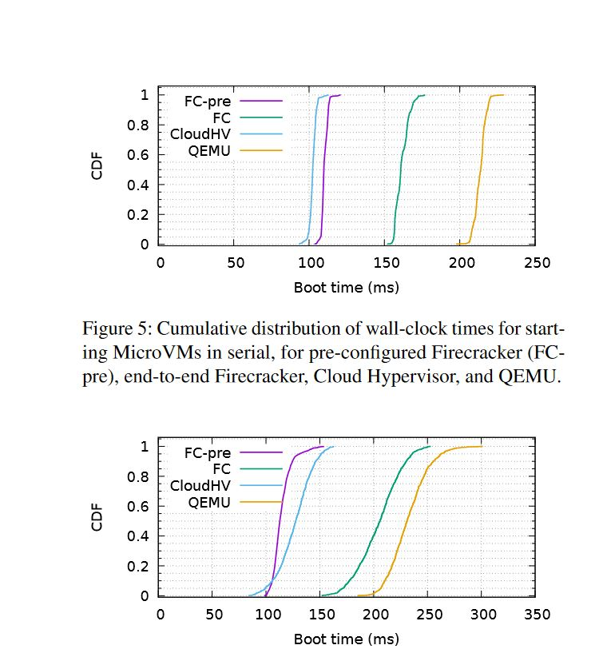

# Questions

* Summarize the project, what it's goals are, and why it exists

        Firecracker is a lightweight virtual machine monitor designed with the goal of achieving the security benefits of virtualization without having to make the traditional sacrifice in performance. The project is being developed as a part of AWS and supports AWS Lambda serverless functions[1].

* What is the target domain of the system? Where is it valuable and where is it not a good fit? 

        Firecracker is being designed to support AWS lambda:[1]
        - IoT
        - Mobile/Web apps
        - request/response/event driven services
        - real time streaming/data processing
        - automation


# Jack

## What is Firecracker? What are it's goals and why does it exist?

* “Firecracker is an open-source virtualization technology that is purpose-built for 
  creating and managing secure, multi-tenant container and function-based services that provide serverless operational models.”

* Firecracker uses minimalist, Linux-based microVMs using containers. 
  These microVMs increase system security and client isolation while also utilizing the increase in speed and resource efficiency that containers provide.

* Firecracker implements a minimalist approach to microVMs which means that only the essential devices and functionality is used and all non-essential parts are removed (minimize the memory footprint). 
  This minimal design allows for an increase in speed as well as security because it reduces the number of places malicious partiescan exploit. 

* Firecracker aims to provide safe and efficient machines and services that allow multiple clients to run on the same device isolated from each other.

###  System Features (from design doc) [2]
* (1) Firecracker can safely run workloads from different customers on the same machine.
* (2) Customers can create microVMs with any combination of vCPU and memory to match their application requirements.
* (3) Firecracker microVMs can oversubscribe host CPU and memory. The degree of oversubscription is controlled by customers, who may factor in workload correlation and load in order to ensure smooth host system operation.
* (4) With a microVM configured with a minimal Linux kernel, single-core CPU, and 128 MiB of RAM, Firecracker supports a steady mutation rate of 5 microVMs per host core per second 
      (e.g., one can create 180 microVMs per second on a host with 36 physical cores).
* (5) The number of Firecracker microVMs running simultaneously on a host is limited only by the availability of hardware resources.
* (6) Each microVM exposes a host-facing API (REST) via an in-process HTTP server.
* (7) Each microVM provides guest-facing access to host-configured metadata via the /mmds API.  

## System Modules

* Firecracker contains many small modules written in Rust. (e.g. jailer, dumbo, firecracker, device manager, event   
  manager, micro_http, rate_limiter, etc.)
    - Each module is small and contains only the necessary information needed to complete a task.

* I think that the modules in Firecracker use the hierarchical approach. Guest vCPUs being lowest in the hierarchy and 
  the host being the highest on the hierarchy. (Seen in figure under Security)

* Isolation barriers: jailer barrier and virtualization barrier (see figure under Security for visualization)
    - Clients are completely isolated from each other.
    - i.e. each Firecracker process (a microVM) is separated from the others.


* Communication between modules: modules communicate via events (through the event manager)
  - Callback system? Example: [9]
  - Event Manager manages I/O notifications and is responsible for managing ePollEvents
```rust
    pub struct EventManager {
        epoll: Epoll,
        subscribers: HashMap<RawFd, Arc<Mutex<dyn Subscriber>>>,
        ready_events: Vec<EpollEvent>,
    }
```

* Performance implications: 

### The Jailer Process

* The jailer process is responsible for starting a new Firecracker process. The jailer initializes system resources that require
  higher priviledges and executes into the Firecracker binary which spawns a new Firecracker process which runs in the VM as an
  unpriviledged process.

* When the jailer is invoked, there are many parameters passed in. These include:
    - A unique `id` which represents a VM
    - An `exec_file` which is the file path to the Firecracker binary that the jailer will execute.
    - A `uid` and `gid` that the jailer will switch to as it executes the binary.
    - ... for a more in-depth look into all of the parameters, see [3].

* When the jailer is invoked, an ArgParser object is created which contains all of the specified arguments and their characteristics.
  This can be seen here [4].

* Once the jailer has created a new ArgParser object, a new environment is created with the arguments. [5]

* The Env struct can be seen below:
```rust
    pub struct Env {
        id: String,
        chroot_dir: PathBuf,
        exec_file_path: PathBuf,
        uid: u32,
        gid: u32,
        netns: Option<String>,
        daemonize: bool,
        start_time_us: u64,
        start_time_cpu_us: u64,
        extra_args: Vec<String>,
        cgroups: Vec<Cgroup>,
    }
```

* Once the Env struct is populated with the arguments and everything is set up, the new Env can be run,
  which will run the exec file and start a new Firecracker process. [6] 

### Dumbo

* Dumbo is a HTTP/TCP/IPv4 network stack that handles guest HTTP requests sent to the configured mmds address.

* Dumbo is disabled by default but can be turned on using the `allow_mmds_requests` parameter.

* "Firecracker only offers virtio-net paravirtualized devices to guests. Drivers running on guest OS use
  ring buffers in shared memory to communicate with the device model for sending or receiving frames."
    - Implementation of these ring buffers can be found at [7]

* Each guest device is associated with a TAP device on the host. [8]
    - Frames sent from guest get written to the TAP fd. [8 Line 174]
    - Frames read from TAP fd are sent to the guest. [8 Line 168]

* Each network device can have one Dumbo stack. Each time a frame is sent from the guest, it is examined
  to see if it should be processed by Dumbo instead of being written to TAP.

* Every time that space becomes available in the ring buffers to send frames to the guest, it first checks Dumbo,
  and then goes back to getting frames from the TAP file descriptor.

### Event Manager


## What are the core technologies and how are they composed?

* The main Firecracker code base is written Rust. (~50k LoC)
* The integration tests are written in Python.
* Firecracker uses a Docker container to standardize the build process and to compose everything together

## Firecracker Security Properties


* Firecracker has strong isolation and containment by having several nested layers all with different levels of trust.
  On top of the different zones, they are separated by different barriers that enforce different aspects of Firecracker security.
  All of these trusted layers and security barriers combine to enforce strong defense in depth.

* Each client is completely isolated from the other clients running on the host. So a breach in one does not spread to other microVM's.

* Firecracker utilizes a minimalist design minimizes the attack-surface (by minimizing the memory footprint) that malicious parties can exploit.

* Small TCB -> Firecracker is ~50k LoC which is 96% less than QEMU. 
  Furthermore, Firecracker's minimalist design removes all unnecessary resources from the system
  which further minimizes Firecracker's TCB.

* This relatively small TCB also touches on the Economy of Mechanism or K.I.S.S.
  This principle discusses the correlation between system complexity and the existence of bugs.
    - More edge-cases -> harder to test
    - Fewer bugs / minimize complexity -> less likely to be compromised and easier to fix.
* Since Firecracker has a relatively small TCB and is relatively simple, this could impact the number
  of bugs in the system and it can make it easier to fix bugs when they come up.

* [1] https://www.usenix.org/system/files/nsdi20-paper-agache.pdf
* [2] https://github.com/firecracker-microvm/firecracker/blob/master/docs/design.md
* [3] https://github.com/firecracker-microvm/firecracker/blob/master/docs/jailer.md
* [4] https://github.com/firecracker-microvm/firecracker/blob/master/src/jailer/src/main.rs#L221-L278
* [5] https://github.com/firecracker-microvm/firecracker/blob/master/src/jailer/src/main.rs#L367-L377
* [6] https://github.com/firecracker-microvm/firecracker/blob/master/src/jailer/src/env.rs#L368-L464
* [7] https://github.com/firecracker-microvm/firecracker/blob/master/src/virtio_gen/src/virtio_ring.rs
* [8] https://github.com/firecracker-microvm/firecracker/blob/main/src/devices/src/virtio/net/tap.rs
* [9] https://github.com/firecracker-microvm/firecracker/blob/main/src/polly/src/event_manager.rs#L50-L71

# Ryan
# What are the modules of the System

## Client facing REST api receives requests from client module
    - The following code is called when the HTTP connection checks for a valid request

```rust
//rust note: match/some ~ switch/case

match find(&self.buffer[*start..end], &[CR, LF]) {
            Some(line_end_index) => {
                // The unchecked addition `start + line_end_index` is safe because `line_end_index`
                // is returned by `find` and thus guaranteed to be in-bounds. This also makes the
                // slice access safe.
                let line = &self.buffer[*start..(*start + line_end_index)];

                // The unchecked addition is safe because of the previous `find()`.
                *start = *start + line_end_index + CRLF_LEN;

                // Form the request with a valid request line, which is the bare minimum
                // for a valid request
                
                /*
                 * Ryan: Creates a wrapper around the incoming HTTP Request
                 * Append the minimum request to the handler's
                 * pending_request queue
                 */
                self.pending_request = Some(Request {
                    request_line: RequestLine::try_from(line)
                        .map_err(ConnectionError::ParseError)?,
                    headers: Headers::default(),
                    body: None,
                });
                self.state = ConnectionState::WaitingForHeaders;
                Ok(true)
            }
            None => {
                // The request line is longer than BUFFER_SIZE bytes, so the request is invalid.
                if end == BUFFER_SIZE && *start == 0 {
                    return Err(ConnectionError::ParseError(RequestError::InvalidRequest));
                } else {
                    // Move the incomplete request line to the beginning of the buffer and wait
                    // for the next `try_read` call to complete it.
                    // This can only happen if another request was sent before this one, as the
                    // limit for the length of a request line in this implementation is 1024 bytes.
                    self.shift_buffer_left(*start, end)
                        .map_err(ConnectionError::ParseError)?;
                }
                Ok(false)
            }
```

[Source](https://github.com/firecracker-microvm/firecracker/blob/main/src/micro_http/src/connection.rs) Lines 161-196

  * The following pops this request off of the parsed requests queue for the HTTP connection and appends it to
        one associated with the client

```Rust
impl<T: Read + Write> ClientConnection<T> {
    /*Ryan: constructor for the HTTP connection associated with this Client
     *  self.connection refers to this struct
     */
    fn new(connection: HttpConnection<T>) -> Self {
        Self {
            connection,
            state: ClientConnectionState::AwaitingIncoming,
            in_flight_response_count: 0,
        }
    }

    fn read(&mut self) -> Result<Vec<Request>> {
        // Data came into the connection.
        let mut parsed_requests = vec![];
        match self.connection.try_read() {
            Err(ConnectionError::ConnectionClosed) => {
                // Connection timeout.
                self.state = ClientConnectionState::Closed;
                // We don't want to propagate this to the server and we will
                // return no requests and wait for the connection to become
                // safe to drop.
                return Ok(vec![]);
            }
            Err(ConnectionError::StreamError(inner)) => {
                // Reading from the connection failed.
                // We should try to write an error message regardless.
                let mut internal_error_response =
                    Response::new(Version::Http11, StatusCode::InternalServerError);
                internal_error_response.set_body(Body::new(inner.to_string()));
                self.connection.enqueue_response(internal_error_response);
            }
            Err(ConnectionError::ParseError(inner)) => {
                // An error occurred while parsing the read bytes.
                // Check if there are any valid parsed requests in the queue.
                while let Some(_discarded_request) = self.connection.pop_parsed_request() {}

                // Send an error response for the request that gave us the error.
                let mut error_response = Response::new(Version::Http11, StatusCode::BadRequest);
                error_response.set_body(Body::new(format!(
                    "{{ \"error\": \"{}\nAll previous unanswered requests will be dropped.\" }}",
                    inner.to_string()
                )));
                self.connection.enqueue_response(error_response);
            }
            Err(ConnectionError::InvalidWrite) => {
                // This is unreachable because `HttpConnection::try_read()` cannot return this error variant.
                unreachable!();
            }
            /*
             * Ryan: the above are all error cases, the loop below is the intended behavior
             *   removes the request from the connection (allowing it to listen for more requests), and place it 
             *   in the client struct's request queue to be dealt with later
             */
            Ok(()) => {
                while let Some(request) = self.connection.pop_parsed_request() {
                    // Add all valid requests to `parsed_requests`.
                    parsed_requests.push(request);
                }
            }
        }
```

[Source](https://github.com/firecracker-microvm/firecracker/blob/main/src/micro_http/src/server.rs) Lines 97 - 150


## VMM
   - The VMM will boot up a new VM in response to a request for action, this happens in  pre-boot and runtime stages
### Pre-boot
- set up vm resources, event manager
- handle preboot requests,  the implementation of which just change some elements of the vmresources struct

```rust
pub fn handle_preboot_request(&mut self, request: VmmAction) -> ActionResult {
        use self::VmmAction::*;

        match request {
            // Supported operations allowed pre-boot.
            ConfigureBootSource(config) => self.set_boot_source(config),
            ConfigureLogger(logger_cfg) => {
                vmm_config::logger::init_logger(logger_cfg, &self.instance_info)
                    .map(|()| VmmData::Empty)
                    .map_err(VmmActionError::Logger)
            }
            ConfigureMetrics(metrics_cfg) => vmm_config::metrics::init_metrics(metrics_cfg)
                .map(|()| VmmData::Empty)
                .map_err(VmmActionError::Metrics),
            GetBalloonConfig => self.balloon_config(),
            GetVmConfiguration => Ok(VmmData::MachineConfiguration(
                self.vm_resources.vm_config().clone(),
            )),
            InsertBlockDevice(config) => self.insert_block_device(config),
            InsertNetworkDevice(config) => self.insert_net_device(config),
            LoadSnapshot(config) => self.load_snapshot(&config),
            SetBalloonDevice(config) => self.set_balloon_device(config),
            SetVsockDevice(config) => self.set_vsock_device(config),
            SetVmConfiguration(config) => self.set_vm_config(config),
            SetMmdsConfiguration(config) => self.set_mmds_config(config),
            StartMicroVm => self.start_microvm(),
            // Operations not allowed pre-boot.
            CreateSnapshot(_)
            | FlushMetrics
            | Pause
            | Resume
            | GetBalloonStats
            | UpdateBalloon(_)
            | UpdateBalloonStatistics(_)
            | UpdateBlockDevice(_)
            | UpdateNetworkInterface(_) => Err(VmmActionError::OperationNotSupportedPreBoot),
            #[cfg(target_arch = "x86_64")]
            SendCtrlAltDel => Err(VmmActionError::OperationNotSupportedPreBoot),
        }
    }
```

[Source](https://github.com/firecracker-microvm/firecracker/blob/main/src/vmm/src/rpc_interface.rs) Lines 279 - 318

- The vm resources struct contains the boot config, network and block devices (the boot config part will be super important later)
```rust
pub struct VmResources {
    /// The vCpu and memory configuration for this microVM.
    vm_config: VmConfig,
    /// The boot configuration for this microVM.
    boot_config: Option<BootConfig>, //Ryan: IMPORTANT!!!!!!!
    /// The block devices.
    pub block: BlockBuilder,
    /// The vsock device.
    pub vsock: VsockBuilder,
    /// The balloon device.
    pub balloon: BalloonBuilder,
    /// The network devices builder.
    pub net_builder: NetBuilder,
    /// The configuration for `MmdsNetworkStack`.
    pub mmds_config: Option<MmdsConfig>,
    /// Whether or not to load boot timer device.
    pub boot_timer: bool,
}
```
[Source](https://github.com/firecracker-microvm/firecracker/blob/main/src/vmm/src/resources.rs) Lines 78-96

## In what conditions is the performance of the system "good"? In what condition is it bad? How does it compare to Linux?

### Good Conditons

* Firecracker performs best when the MicroVMs are pre-configured through the pre-boot controllers API
    - Recall the `VmResources -> boot_config` member above



* This graph[1] shows the boot times for firecracker microVMs (pre-configured and otherwise), compared to QEMU and CloudHV
    - FC-pre has significantly better performance than QEMU, slightly better than CloudHV for parallel
    - FC is still better than QEMU, but performs notable worse than FC-pre

### Bad conditions

* Firecracker suffers when there is no pre-specified boot configuration available to it (see the graph above)
* Serverless workloads
    - Firecracker VMs are NOT persistent, they are destroyed after they finish running and rebuilt to service the next request
    - Systems requiring more persistent VM support should use other options


## Security Properties

### CIA

* Confidentiality
    - Since VMs are created to respond to a job and destroyed after, the actions/data of any VM should be confidential from the others as they stop existing once the work is done.
    - The `struct VmResources` seems to contain everything the VMM needs, so that would be the only thing not confidential to the VMM

* Integrity
    - Once the firecrackerVM boots up, there are a set of requests that it is no longer allowed to make to the VMM, such as changing it's network configuration or loading a new snapshot.

```rust
 // Operations not allowed post-boot.
            ConfigureBootSource(_)
            | ConfigureLogger(_)
            | ConfigureMetrics(_)
            | InsertBlockDevice(_)
            | InsertNetworkDevice(_)
            | LoadSnapshot(_)
            | SetBalloonDevice(_)
            | SetVsockDevice(_)
            | SetMmdsConfiguration(_)
            | SetVmConfiguration(_)
            | StartMicroVm => Err(VmmActionError::OperationNotSupportedPostBoot),
```

* Availability
    - By working around serverless workloads, firecracker is able to guarantee availability of VMs up the point where the maximum number of concurrent VMs are active (TODO: figure out if this is a hard number or just a range).
    - A user attempting to launch a DoS attack would only be able to deny service within their own VM, which no other users share

# Optimizations

## Pre-configured firecracker VMs for quicker boot
* Per the performance graph above, FC-pre (firecracker booting a pre-configured VM) is much faster than booting a VM that wasn't pre-configured (both are faster than QEMU).

```rust
/// Holds the kernel configuration.
#[derive(Debug)]
pub struct BootConfig {
    /// The commandline validated against correctness.
    pub cmdline: kernel::cmdline::Cmdline,
    /// The descriptor to the kernel file.
    pub kernel_file: std::fs::File,
    /// The descriptor to the initrd file, if there is one
    pub initrd_file: Option<std::fs::File>,
}
```
[Source](https://github.com/firecracker-microvm/firecracker/blob/main/src/vmm/src/vmm_config/boot_source.rs#L66-L75)

Boot config struct, contains a reference to the kernel file which is loaded into the VMM for boot.

### KVM interaction 
* The KVM is loaded in as a crate (the Rust equivalent of a library)
    - The VMM calls `setup_kvm_vm()` when setting up the VMM and VCPUs

```rust

pub(crate) fn setup_kvm_vm(
    guest_memory: &GuestMemoryMmap,
    track_dirty_pages: bool,
) -> std::result::Result<Vm, StartMicrovmError> {
    use self::StartMicrovmError::Internal;
    let kvm = KvmContext::new()
        .map_err(Error::KvmContext)
        .map_err(Internal)?;
    let mut vm = Vm::new(kvm.fd()).map_err(Error::Vm).map_err(Internal)?;
    vm.memory_init(&guest_memory, kvm.max_memslots(), track_dirty_pages)
        .map_err(Error::Vm)
        .map_err(Internal)?;
    Ok(vm)
}
```

[Source](https://github.com/firecracker-microvm/firecracker/blob/main/src/vmm/src/builder.rs#L543-L556)

* The KvmContext constructor sets up the ioctl capabilites that the VMM has

```rust
  // A list of KVM capabilities we want to check.
        #[cfg(target_arch = "x86_64")]
        let capabilities = vec![
            Irqchip,
            Ioeventfd,
            Irqfd,
            UserMemory,
            SetTssAddr,
            Pit2,
            PitState2,
            AdjustClock,
            Debugregs,
            MpState,
            VcpuEvents,
            Xcrs,
            Xsave,
            ExtCpuid,
        ];

        #[cfg(target_arch = "aarch64")]
        let capabilities = vec![
            Irqchip, Ioeventfd, Irqfd, UserMemory, ArmPsci02, DeviceCtrl, MpState, OneReg,
        ];
```

[Source](https://github.com/firecracker-microvm/firecracker/blob/main/src/vmm/src/vstate/system.rs#L60-L82)

* [Setting up custom kernel image](https://github.com/firecracker-microvm/firecracker/blob/main/docs/rootfs-and-kernel-setup.md)
    - This documentation shows how to build Linux v4.20 to be booted into a firecracker VM
    - Once built into the `vmlinux` kernel image, can be referenced by the `BootConfig.kernel_file`